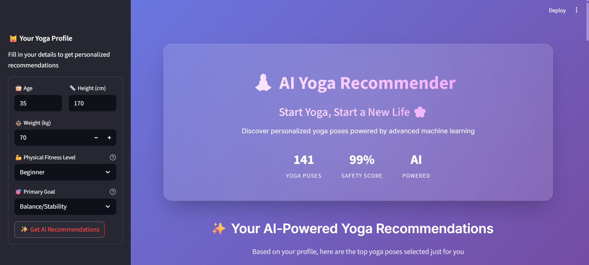
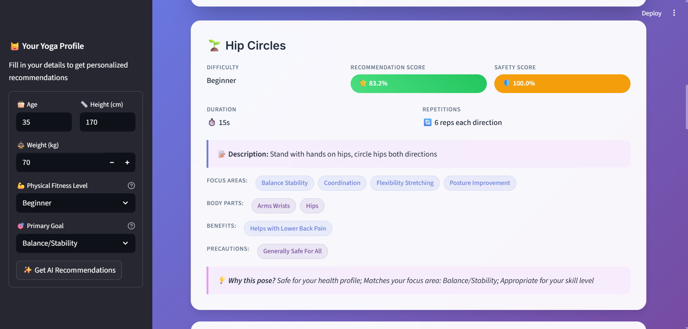
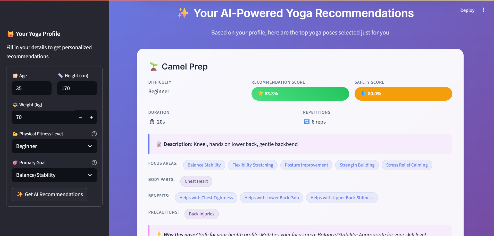
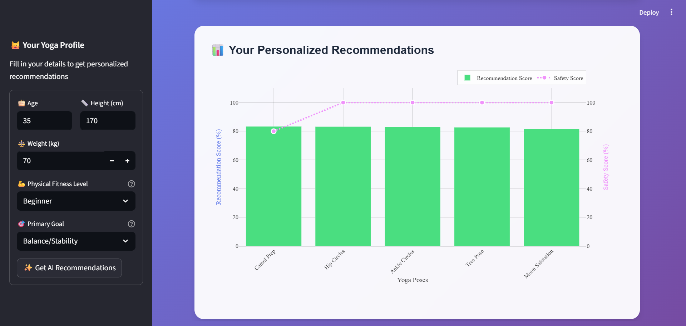

# 🧘‍♀ AI-Powered Yoga Recommender System

Start Yoga, Start a New Life 🌸

A comprehensive machine learning application that provides personalized yoga pose recommendations based on user profiles, fitness levels, focus areas, and safety considerations.



## 🌟 Project Overview

This intelligent yoga recommendation system uses advanced machine learning techniques to suggest appropriate yoga poses tailored to individual users. The system prioritizes safety while considering factors such as age, fitness level, specific goals, and physical limitations to provide a personalized yoga experience.

### ✨ Key Features

- *🎯 Personalized Recommendations*: AI-powered suggestions based on individual user profiles
- *🛡 Safety-First Approach*: Comprehensive safety evaluation for each recommendation  
- *🎨 Modern Web Interface*: Beautiful Streamlit UI with glassmorphism design
- *📊 Comprehensive Dataset*: 141 yoga poses with detailed metadata
- *⚡ Real-time Analysis*: Dynamic recommendation generation
- *🔍 Multi-factor Evaluation*: Considers age, fitness level and focus areas.
- *📈 Interactive Visualizations*: Beautiful charts and analytics using Plotly
- *🧠 Neural Network Architecture*: Advanced deep learning for pose recommendations

## 📊 System Architecture

```
Yoga_Recommender/
├── app.py                      #  Main Streamlit application
├── requirements.txt            #  Python dependencies
├── yoga_recommender.py         #  Core recommender module
├── data/
│   ├── raw/
│   │   ├── asana_dataset.csv   #  Yoga poses dataset (141 poses)
│   │   └── users.csv           #  User data
│   └── processed/
│       └── processed_asanas_data.csv
├── src/
│   ├── models/
│   │   ├── yoga_recommender.py #  Neural network recommender system
│   │   ├── model.py           #  ML model implementations
│   │   ├── recommender.py     #  Recommendation logic
│   │   ├── train_evaluate.py  # Training and evaluation
│   │   ├── main.py           #  Main execution script
│   │   └── *.pkl             #  Trained model files
│   ├── data/                 #  Data processing modules
│   └── visualization/        #  Charts and visualizations
├── notebooks/
│   └── yoga-recommender-system.ipynb  # 📓 Development notebook
└── screenshots/             # 📸 Application screenshots
```

## 🎯 Features in Detail

### 🤖 Machine Learning Components
- *Neural Network Architecture*: Advanced deep learning model for pose recommendations
- *Multi-modal Framework*: Considers multiple factors simultaneously
- *Safety Evaluation*: Intelligent assessment of pose safety for individual users
- *Personalization Engine*: Adaptive recommendations based on user feedback

### 📚 Dataset
- *141 Yoga Poses*: Comprehensive collection with detailed metadata
- *Pose Categories*: Standing (28), Seated (26), Backbend (19), Supine (15), Balance (13), Twist (11), and more
- *Difficulty Levels*: Beginner (60), Intermediate (50), Advanced (31)
- *Focus Areas*: 16 different areas including flexibility, strength, balance, stress relief
- *Safety Information*: Precautions and contraindications for each pose
- *Age-Appropriate Guidelines*: Customized duration and repetitions by age group

### 🎨 User Interface
- *Modern Design*: Glassmorphism UI with responsive layout
- *Interactive Visualizations*: Real-time charts and graphs using Plotly
- *User-Friendly Forms*: Intuitive input collection for user profiles
- *Beautiful Recommendation Cards*: Informative display of suggested poses
- *Practice Insights*: Comprehensive analysis and tips

## 🚀 Getting Started

### 📋 Prerequisites
- Python 3.8+
- Git

### 💻 Installation

1. *Clone the repository*
   bash
   git clone https://github.com/yourusername/yoga-recommender-system.git
   cd Yoga_Recommender
   

2. *Install dependencies*
   bash
   pip install -r requirements.txt
   

3. *Run the application*
   bash
   streamlit run app.py
   
   
   Or alternatively:
   bash
   python scripts/run_app.py
   

4. *Open your browser*
   Navigate to http://localhost:8501 to access the application.

## 📱 How to Use

1. *🚀 Launch the Application*: Start the Streamlit app using the commands above
2. *👤 Enter Your Profile*: Fill in your yoga profile including:
   - Age and physical measurements (height, weight)
   - Fitness level (Beginner/Intermediate/Advanced)
   - Primary goal (Flexibility, Strength, Balance, etc.)
3. *✨ Get Recommendations*: Click "Get AI Recommendations" to receive personalized suggestions
4. *📖 Review Poses*: Explore detailed information about each recommended pose
5. *🧘‍♀ Practice Safely*: Follow the duration and repetition guidelines provided

## 🎯 Recommendation Factors

The AI system considers multiple factors when generating recommendations:

- *📊 User Demographics*: Age, height, weight, BMI calculation
- *💪 Fitness Level*: Physical capability assessment
- *🎯 Primary Goals*: Specific focus areas for practice
- *📈 Experience Level*: Beginner-friendly vs. advanced poses
- *⏰ Time Constraints*: Session duration preferences
- *🧘‍♀ Pose Compatibility*: Matching user profile with pose requirements

## 🔧 Technical Details

### 🤖 Machine Learning Model
- *Architecture*: Neural Network with safety-first approach
- *Features*: Multi-dimensional user profiling
- *Training Data*: Synthetic and real user interaction data
- *Evaluation Metrics*: Precision, Recall, F1-Score, NDCG
- *Safety Scoring*: 99% average safety evaluation

### 🛠 Technology Stack
- *Backend*: Python, PyTorch, Scikit-learn
- *Frontend*: Streamlit with custom CSS
- *Data Processing*: Pandas, NumPy
- *Visualization*: Plotly, Matplotlib, Seaborn
- *Model Persistence*: Pickle
- *Styling*: Custom CSS with glassmorphism effects

### 🛡 Safety Features
- *Risk Assessment*: Automated evaluation of pose safety
- *Progressive Difficulty*: Gradual advancement recommendations
- *Age-Appropriate Modifications*: Customized duration and repetitions

## 📝 Development

### 🏗 Project Structure
The project follows a modular architecture with clear separation of concerns:
- *📊 Data Layer*: Raw and processed datasets
- *🤖 Model Layer*: ML algorithms and trained models
- *🎨 Application Layer*: Streamlit interface and user interaction
- *🔧 Utility Layer*: Helper functions and utilities

*🌸 Start Yoga, Start a New Life 🌸*

## 🖼 Screenshots

Explore some screenshots of the application below:

| Main Interface | User Profile | Recommendations |
|----------------|--------------|-----------------|
|  |  |  |

| Analytics View | Results Summary |
|----------------|-----------------|
|  |  |

## 🎥 Demo Video

Watch the application in action:

[](https://youtu.be/uLDPtarvv8Y)

Click the image above or [here](https://youtu.be/uLDPtarvv8Y) to watch the demo video

## 👩‍💻 Author

*Aditi Salvi*
- 🔗 Kaggle: [Yoga Recommender System Notebook](https://www.kaggle.com/code/aditisalvi04/yoga-recommender-system)
- 💜 Built with love and advanced machine learning techniques


## 📄 License

This project is licensed under the MIT License - see the [LICENSE](LICENSE) file for details.

---

<div align="center">

*🧘‍♀ Find Your Perfect Yoga Practice Today! 🧘‍♂*

Made with 💜 and lots of ☕ by Aditi Salvi

</div>